# Configuration Overview

Learn how to configure SF Data Export Automation for your specific Salesforce environment and requirements.

## :material-cog: Configuration Components

The automation requires three main configuration components:

```mermaid
graph LR
    A[🔐 SFDX Authentication] --> B[☁️ Google Drive]
    B --> C[🔑 Colab Secrets]
    C --> D[✅ Ready to Run]
```

### 1. SFDX Authentication
Set up secure authentication with your Salesforce org using the official Salesforce CLI.

[:octicons-arrow-right-24: SFDX Authentication Guide](sfdx-auth.md)

### 2. Google Drive Integration
Configure Google Drive mounting and file organization for your exports.

[:octicons-arrow-right-24: Drive Setup Guide](drive-setup.md)

### 3. Colab Secrets Management
Securely store your authentication credentials in Google Colab.

[:octicons-arrow-right-24: Secrets Configuration](secrets.md)

## :material-list-status: Configuration Checklist

!!! abstract "Before Running the Automation"
    Ensure you've completed all configuration steps:
    
    - [x] Generated SFDX Auth URL
    - [x] Stored Auth URL in Colab Secrets
    - [x] Tested Salesforce connectivity
    - [x] Configured Google Drive access
    - [x] Verified export permissions

## :material-tune: Advanced Configuration

### Organization-Specific Settings

!!! tip "Customization Options"
    - **Multiple Orgs**: Configure authentication for different Salesforce orgs
    - **File Naming**: Customize export file naming conventions
    - **Storage Location**: Organize files in custom Drive folders
    - **Scheduling**: Set up automated execution schedules

### Security Considerations

!!! security "Best Practices"
    - **Rotate Auth URLs** regularly (every 90 days recommended)
    - **Use dedicated service accounts** for automation
    - **Monitor access logs** in Salesforce
    - **Limit export permissions** to necessary users only

## :material-help: Configuration Support

Need help with configuration? Check out these resources:

- [Common Issues](../troubleshooting/common-issues.md) - Solutions to frequent problems
- [FAQ](../troubleshooting/faq.md) - Frequently asked questions
- [Error Codes](../troubleshooting/error-codes.md) - Error code reference

[Start Configuration :material-arrow-right:](sfdx-auth.md){ .md-button .md-button--primary }
