# SF Data Export Automation

-   :material-rocket-launch:{ .lg .middle } **Quick Start**

    ---

    Get up and running in minutes with our step-by-step guide

    [:octicons-arrow-right-24: Getting Started](setup/quickstart.md)

-   :material-cog:{ .lg .middle } **Configuration**

    ---

    Learn how to configure SFDX authentication and Google Drive integration

    [:octicons-arrow-right-24: Configuration Guide](configuration/)

-   :material-play:{ .lg .middle } **Usage**

    ---

    Detailed instructions on running the automation and managing exports

    [:octicons-arrow-right-24: Usage Guide](usage/)

-   :material-help-circle:{ .lg .middle } **Troubleshooting**

    ---

    Solutions to common issues and frequently asked questions

    [:octicons-arrow-right-24: Get Help](troubleshooting/)

## :material-star: Overview

**SF Data Export Automation** is a powerful Google Colab notebook that automates the download of Salesforce Weekly Exports directly to your Google Drive. No more manual downloads - just set it up once and run it whenever you need your latest exports.

!!! success "Key Features"
    - :material-check: **Automated Authentication** - Secure SFDX integration
    - :material-check: **Google Drive Integration** - Direct backup to organized folders
    - :material-check: **Progress Tracking** - Visual progress bars and status updates
    - :material-check: **Error Handling** - Robust error detection and recovery
    - :material-check: **No Local Storage** - Everything runs in the cloud

## :material-lightbulb: How It Works

```mermaid
graph LR
    A[🔐 SFDX Auth] --> B[📥 Fetch Export IDs]
    B --> C[☁️ Mount Google Drive]
    C --> D[📦 Download Exports]
    D --> E[✅ Organized Backup]
```

The automation works in four simple steps:

1. **Authenticate** with Salesforce using your SFDX Auth URL
2. **Discover** available weekly export files automatically
3. **Download** exports with progress tracking and error handling
4. **Organize** files in dated folders in your Google Drive

## :material-rocket: Why Choose This Solution?

!!! tip "Perfect For"
    - **Data Teams** who need regular Salesforce backups
    - **Administrators** managing multiple orgs
    - **Developers** who want automated data pipelines
    - **Anyone** tired of manual export downloads

## :material-clock: Time Savings

| Task | Manual Process | Automated Process |
|------|----------------|-------------------|
| Login to Salesforce | 30 seconds | Automatic |
| Navigate to Exports | 45 seconds | Automatic |
| Download Files | 2-5 minutes | Automatic |
| Organize Files | 1-2 minutes | Automatic |
| **Total Time** | **4-8 minutes** | **30 seconds** |

## :material-security: Security & Privacy

!!! note "Your Data is Safe"
    - All authentication is handled through official Salesforce SFDX CLI
    - No credentials are stored or transmitted outside of Google's secure environment
    - Files are downloaded directly to your personal Google Drive
    - The notebook runs entirely in your Google Colab environment

## :material-trending-up: Get Started Now

Ready to automate your Salesforce exports? Follow our quick start guide to get up and running in just a few minutes.

[Get Started :material-arrow-right:](setup/quickstart.md){ .md-button .md-button--primary }
[View Configuration :material-arrow-right:](configuration/){ .md-button }
