# Setup Overview

Welcome to the setup section! Here you'll find everything you need to get SF Data Export Automation up and running.

## :material-list-box: Setup Checklist

!!! abstract "Before You Begin"
    Make sure you have the following prerequisites:
    
    - [x] Google account with access to Google Colab
    - [x] Salesforce org with data export permissions
    - [x] Google Drive with sufficient storage space
    - [x] Basic familiarity with running Jupyter notebooks

## :material-map: Setup Process

The setup process involves three main steps:

```mermaid
graph TD
    A[📋 Prerequisites] --> B[🚀 Quick Start]
    B --> C[🔧 Google Colab Setup]
    C --> D[✅ Ready to Use]
```

### 1. Prerequisites
Ensure you have all the necessary accounts and permissions.

[:octicons-arrow-right-24: Check Prerequisites](prerequisites.md)

### 2. Quick Start
Follow our step-by-step guide to get running immediately.

[:octicons-arrow-right-24: Quick Start Guide](quickstart.md)

### 3. Google Colab Setup
Detailed setup instructions for the Colab environment.

[:octicons-arrow-right-24: Colab Setup](colab-setup.md)

## :material-help: Need Help?

If you run into any issues during setup, check out our troubleshooting section:

[:octicons-arrow-right-24: Troubleshooting Guide](../troubleshooting/)
