# Usage Guide

Learn how to effectively use SF Data Export Automation to streamline your Salesforce data exports.

## :material-play-circle: Usage Overview

Once configured, SF Data Export Automation provides a simple, reliable way to download your Salesforce weekly exports with just a few clicks.

!!! success "What You Can Do"
    - **Download all available exports** with one notebook run
    - **Organize files automatically** in dated Google Drive folders
    - **Track progress visually** with real-time status updates
    - **Handle errors gracefully** with detailed error reporting
    - **Manage file duplicates** intelligently

## :material-list-status: Usage Workflow

```mermaid
graph TD
    A[🚀 Open Notebook] --> B[▶️ Run Authentication]
    B --> C[📥 Fetch Export IDs]
    C --> D[☁️ Mount Google Drive]
    D --> E[📦 Download Exports]
    E --> F[📊 Review Summary]
    F --> G[✅ Files in Drive]
```



### Step-by-Step Process

1. **[Running the Notebook](running.md)** - Execute cells and monitor progress
2. **[Download Process](download-process.md)** - Understanding what happens during downloads
3. **[File Management](file-management.md)** - Organizing and managing your exports

## :material-clock-time-four: When to Run

### Recommended Schedule

!!! tip "Optimal Timing"
    **Weekly Schedule:**
    - Run **once per week** after Salesforce generates new exports
    - **Monday mornings** often work well (exports from weekend)
    - **Consistent timing** helps establish routine
    
    **On-Demand:**
    - Before important data analysis projects
    - Prior to system maintenance windows
    - When exports are specifically requested

### Export Availability

!!! info "Salesforce Export Timing"
    - **Weekly exports** are generated automatically by Salesforce
    - **Available for 48 hours** after generation
    - **1-4 exports** typically available at any time
    - **Check availability** before running automation

## :material-speedometer: Performance Expectations

### Typical Runtime

!!! abstract "Expected Duration"
    | Org Size | Export Size | Download Time |
    |----------|-------------|---------------|
    | Small | 10-100 MB | 1-3 minutes |
    | Medium | 100 MB - 1 GB | 3-10 minutes |
    | Large | 1-5 GB | 10-30 minutes |
    | Enterprise | 5+ GB | 30+ minutes |

### Factors Affecting Performance

!!! note "Performance Variables"
    - **Internet connection speed** - primary factor
    - **Salesforce server load** - varies by time of day
    - **Google Colab resources** - generally consistent
    - **File compression** - varies by data type
    - **Concurrent users** - minimal impact

## :material-check-circle: Success Indicators

### Visual Feedback

!!! success "What Success Looks Like"
    You'll see these indicators when everything works correctly:
    
    - ✅ **Green checkmarks** for completed steps
    - 📊 **Progress bars** during downloads
    - 📋 **Summary table** with file details
    - 🎉 **Completion message** with file count and sizes

### Final Results

!!! example "Expected Output"
    ```
    📊 EXPORT DOWNLOAD SUMMARY
    ============================================================
    ✅ Successfully downloaded 3 export files:
       1. WE_00D8Z000001rMLAUA2_1.ZIP (1.2 GB)
       2. WE_00D8Z000001rMLAUA2_2.ZIP (850 MB)
       3. WE_00D8Z000001rMLAUA2_3.ZIP (1.1 GB)
    
    📁 Total backup size: 3.15 GB
    📂 Backup folder: /content/drive/MyDrive/SF_WeeklyExport_20250526
    ```

## :material-alert-circle: Common Scenarios

### First-Time Usage

!!! abstract "New User Experience"
    Your first run will include:
    - **Google Drive authorization** - one-time setup
    - **SFDX CLI installation** - automatic in Colab
    - **Credential validation** - testing your setup
    - **Folder creation** - setting up organization structure

### Regular Usage

!!! tip "Routine Operations"
    Subsequent runs are faster:
    - **Skip authorization** - already configured
    - **Quick authentication** - cached credentials
    - **Duplicate detection** - skip existing files
    - **Faster startup** - dependencies already installed

### Troubleshooting Mode

!!! warning "When Things Go Wrong"
    If issues occur:
    - **Check error messages** - usually very specific
    - **Restart runtime** - clears any stuck processes
    - **Re-run cells individually** - isolate problems
    - **Review configuration** - verify secrets and permissions

## :material-chart-line: Monitoring and Reporting

### Built-in Monitoring

!!! info "Automatic Tracking"
    The automation provides detailed progress information:
    
    - **Real-time status updates** during each phase
    - **File-by-file download progress** with progress bars
    - **Error detection and reporting** with specific messages
    - **Final summary** with complete statistics

### Custom Reporting

!!! tip "Enhanced Tracking"
    You can enhance monitoring by:
    
    - **Taking screenshots** of summary reports
    - **Copying results** to a tracking spreadsheet
    - **Setting up Drive notifications** for new folders
    - **Creating calendar reminders** for regular runs

## :material-arrow-right: Next Steps

Ready to start using the automation? Follow these guides:

[Learn to Run the Notebook :material-arrow-right:](running.md){ .md-button .md-button--primary }
[Understand the Download Process :material-arrow-right:](download-process.md){ .md-button }
